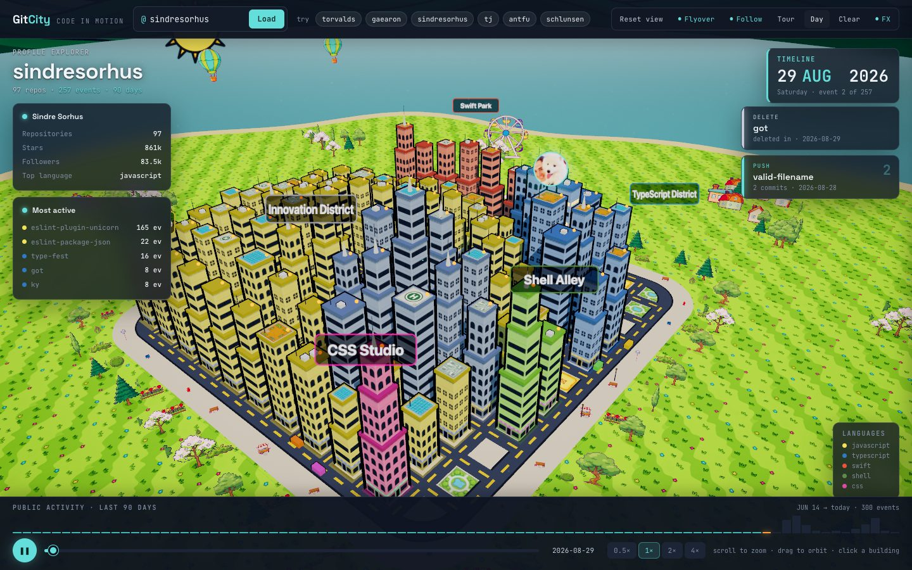
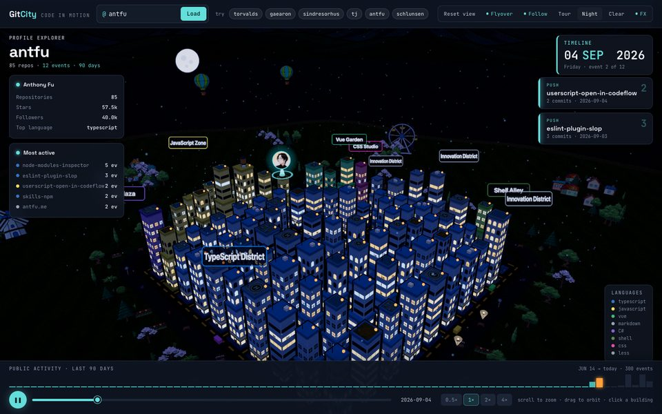
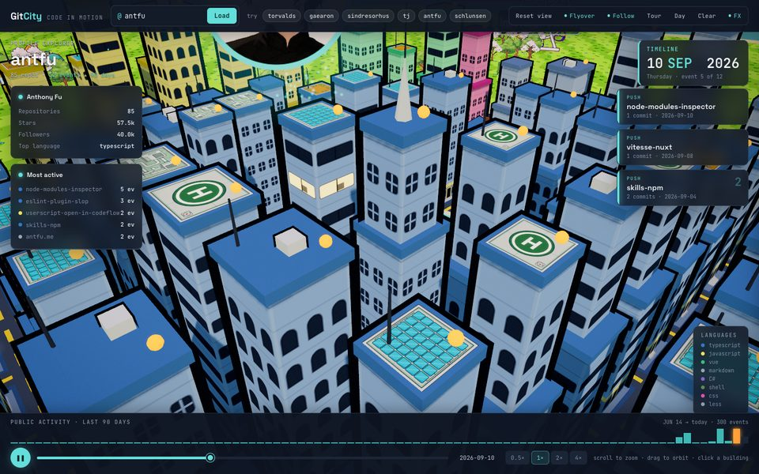
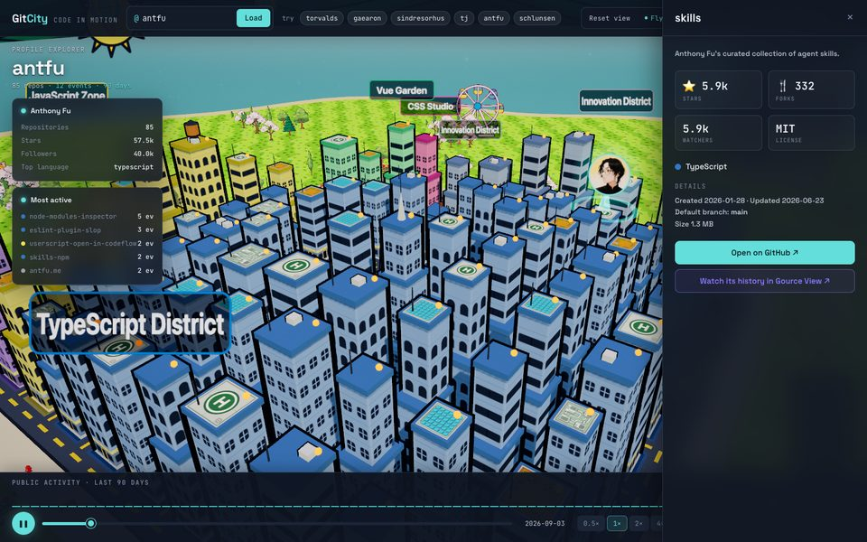
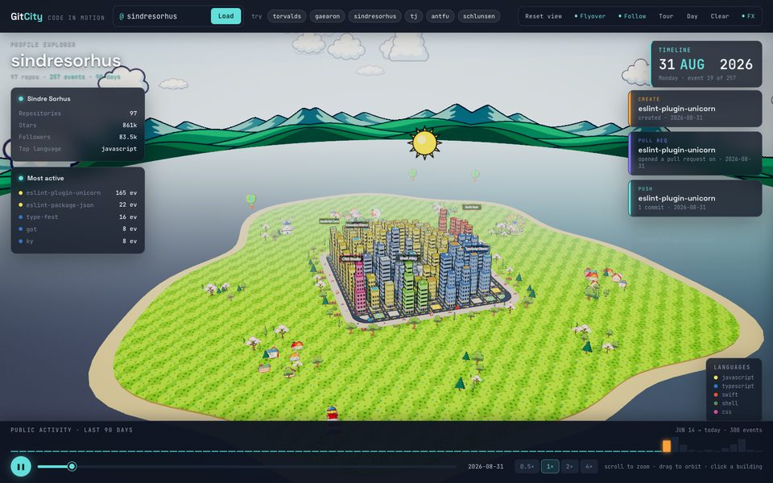

<div align="center">

# 🏙️ Git City

**Turn any GitHub profile into a living cartoon city.**

Every repository becomes a building. Stars make it tall, the language paints it,
and the last 90 days of activity play back as the developer flies across the
skyline — beaming pushes, pull requests and stars onto the rooftops.

[**▶ Open Git City**](https://schlunsen.github.io/git-city/) ·
[torvalds](https://schlunsen.github.io/git-city/?user=torvalds) ·
[sindresorhus](https://schlunsen.github.io/git-city/?user=sindresorhus) ·
[antfu](https://schlunsen.github.io/git-city/?user=antfu) ·
[gaearon](https://schlunsen.github.io/git-city/?user=gaearon) ·
[schlunsen](https://schlunsen.github.io/git-city/?user=schlunsen)

[](https://github.com/schlunsen/git-city/actions/workflows/pages.yml)


[](LICENSE)



</div>

## What you're looking at

| On GitHub | In the city |
| --- | --- |
| 📦 A repository | A building on its own lot |
| ⭐ Stars | Height and footprint (log scale — a 100k★ tower still leaves room for the rest) |
| 🎨 Primary language | Facade colour, and the **district** it's zoned into around the central plaza |
| 🏆 Most-starred repos | Closest to the plaza; 100★+ get a glowing rooftop beacon |
| 🔥 Public activity (90 days) | Gource-style playback: the avatar flies to each repo and beams it — teal pushes, purple PRs and reviews, blue issues, orange stars and releases |
| 📅 Daily activity | A heatmap ring of bricks around the plaza |

Small profiles still get a lived-in town: empty lots fill with parks, courts,
parking and construction sites.

## Gallery

<table>
  <tr>
    <td width="50%"><br><sub><b>Night falls</b> — windows light up one by one, lamps and stars come out. Day/night follows your local clock.</sub></td>
    <td width="50%"><br><sub><b>Up close</b> — painted facades, tiered towers, helipads, rooftop gardens and solar roofs.</sub></td>
  </tr>
  <tr>
    <td width="50%"><br><sub><b>Click any building</b> for the repo's stats — then watch its full commit history in <a href="https://schlunsen.github.io/gource-view/">Gource View</a>.</sub></td>
    <td width="50%"><br><sub><b>Zoom out</b> — the city sits on its own island, with villages, woods, a lighthouse and hot-air balloons.</sub></td>
  </tr>
</table>

## Things to try

- **Scrub the timeline** at the bottom, or change the speed (0.5×–4×)
- Press **T** for a cinematic fly-through, **Space** to play / pause, **Esc** to close panels
- Toggle **Day / Night / Auto / Cycle**, then make it **rain** or **snow**
- Click a repo in the explorer on the left to fly the camera to it
- Turn **Follow** on and the camera drifts after the developer as they work

## Customize your city

Your island is generated from your profile, but you can take over the parts
you care about with one file in your profile repository,
`<login>/<login>/.git-city/city.json`: name the island, write the welcome
boards, pick the biome, city shape and landmarks, feature or hide
repositories, give buildings their own colours, signs and billboards, choose
your neighbours, set the look (accent, time, weather, TV / FX), the player's
soundtrack and your plane's livery.

```json
{
  "$schema": "https://schlunsen.github.io/git-city/schema/city-config.v1.json",
  "version": 1,
  "island": { "name": "Schlunsen Isle", "biome": "tropical" },
  "welcome": "Welcome to my city!",
  "featured": ["git-city", "gource-view"]
}
```

Or open your city, press **Customize**, preview your changes live on the
island, and **Publish**: it opens GitHub's own editor with the file filled in
(no tokens, no OAuth). The file is data only, strictly validated, and never
makes Git City load anything.

Maintainers can style a single repository's building too (graffiti, roof,
neon windows, a flag, colour, silhouette) with `.git-city/building.json` in
the repository itself; the owner's `city.json` wins, field by field.

- **[How to customize](https://schlunsen.github.io/git-city/customize.html)**:
  the step-by-step guide for both levels, with copyable examples
- [docs/city-config.md](docs/city-config.md): every field, the limits, caching
  (about 5 minutes), security and troubleshooting
- [docs/building-config.md](docs/building-config.md): the per-repository file
- JSON Schemas for editor autocompletion:
  [city-config.v1.json](public/schema/city-config.v1.json),
  [building-config.v1.json](public/schema/building-config.v1.json)

## How it's built

Plain ES modules and [Three.js](https://threejs.org) from a CDN — no bundler,
no framework, no build step. The whole app is the [`public/`](public) folder.

- **Toon rendering** — `MeshToonMaterial` on a shared stepped ramp, inverted-hull
  ink outlines, a hand-written post pass (bloom, day/night grade, vignette, grain)
  and a banded cel-shaded sky
- **Facades** are painted per building onto canvases, with a separate emissive
  map so individual windows light up at night
- **The world** ([`world.js`](public/world.js)) is paper cutouts: generated,
  chroma-keyed sprites for trees, houses, props and landmarks, billboarded to face
  the camera, plus top-down decals for roofs and empty lots
- **Layout** clusters repositories into language districts on a grid with a
  rounded boulevard; traffic follows the curves
- **Timeline** ([`history.js`](public/history.js)) merges GitHub events into
  paced "steps" the flying actor acts out

## Running locally

```sh
node server.mjs            # → http://localhost:8000
node --test tests/         # layout + timeline unit tests
```

Any static file server works. Add `?user=<login>` to load a profile, or
`?demo=1` to use the bundled snapshots only.

## The GitHub rate limit

The browser talks to the GitHub API directly, and anonymous visitors get
**60 requests an hour**. So the featured developers ship with snapshots in
[`public/fixtures/`](public/fixtures), refreshed every day by
[a GitHub Action](.github/workflows/pages.yml). Git City uses a fresh snapshot
when it has one, goes live otherwise, and falls back to the snapshot if GitHub
says no.

```sh
GITHUB_TOKEN=$(gh auth token) node scripts/scrape.mjs          # refresh all
node scripts/scrape.mjs torvalds antfu                          # just a few
```

Snapshots only name repositories the profile owns — activity elsewhere is kept
for the daily heatmap but anonymised.

## Companion: Gource View

[Gource View](https://github.com/schlunsen/gource-view) replays a single
repository's entire commit history as a Gource-style animation. The two link to
each other: open a building here to watch its history there, and click an
author there to see their city here.

## Credits

The cutout sprites, tiles and backdrop in [`public/assets/`](public/assets) were
generated with an image model, then chroma-keyed and split by script. They are
part of this repository and covered by its license. Language colours follow
GitHub's linguist palette.

## License

MIT — see [LICENSE](LICENSE).
