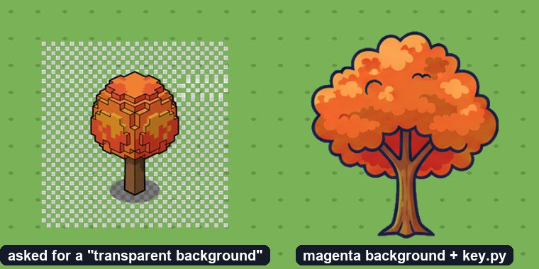
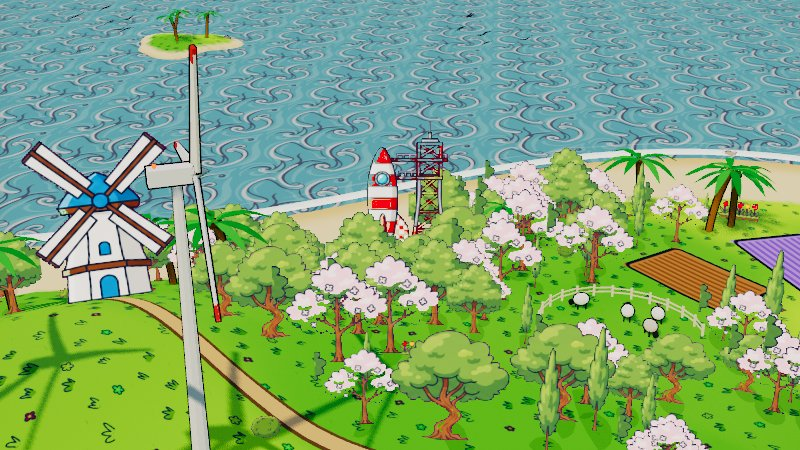

# Making new art for Gitilla

All the art in `public/assets/` comes from one pipeline:
- the paper-cutout trees, houses, props and landmarks
- the lot and roof decals
- the grass and sea tiles
- the hills backdrop

Each piece is generated by an image model, chroma-keyed and split by a script, then placed from code. This guide is written for agents (and people) adding to that set. It ends with a worked example, the rocket launch pad (`landmarks-4.png`), which was made exactly as described here.

```
scripts/assets/generate.py   prompt → raw sheet     (scripts/assets/raw/, git-ignored)
scripts/assets/key.py        raw sheet → PNGs       (public/assets/, committed)
public/world.js              PNGs → the island      (SPRITE_COUNTS, enums, placement)
```

## The rules, and what breaking them looks like

These come from real mistakes. Read them before generating anything.



1. **Never ask for a transparent background.**
   - **Why:** image models can't output transparency. Ask for "transparent", "PNG with alpha" or "isolated on transparent" and they *paint* a grey-and-white checkerboard into the picture.
   - **What it looks like:** a white-background remover then leaves the grey squares behind, so the object stands in a see-through checkered box on the island (left).
   - **Do instead:** always use the flat magenta background (`MAG`) and `key.py` (right).
2. **Side view, never isometric or 3/4.**
   - **Why:** cutouts are billboards that turn to face the camera.
   - **What it looks like:** an isometric drawing shows its top from every angle, and a flat object drawn from above (a pier, a fountain basin) looks like a card standing on its edge.
3. **No painted ground shadows.** The island draws its own blob shadows. A painted shadow doubles up and keys out badly. Add "no ground shadows" to the subject.
4. **The bottom edge of the image is the ground.**
   - **Why:** `plant()` and `cutout()` stand the image's bottom edge on the terrain.
   - **What it looks like:** an object centred in a padded square floats above the ground by the padding.
   - **Do instead:** `key.py` trims every sprite to its object. Don't re-pad the result.
5. **One sprite sheet per batch, not one image per object.**
   - One image of four objects in a row costs the same as one object.
   - All four share a style, and `key.py` splits them.
6. **Reuse before you generate.** The `props` sheet already has a lamp post, a bench, a fire hydrant, a mailbox, a food cart and a bus stop (`PROP` in `world.js`). A second hydrant in a different style makes the island look patched together.
7. **Only `generate.py` → `key.py`.** Don't process images with other scripts or tools; every committed PNG should be reproducible from a `JOBS` entry.
8. **Say "no faces".** Ask for cute plants and the model gives them eyes and smiles (the first sunflowers, cactus and stump all had them). Add "plain plants with no faces, eyes or smiles".
9. **Glass must be opaque.** Ask for glass and the model paints it see-through, so the magenta shows through the panes, and nothing can tell that apart from a pink surface. The first bus shelter had pink windows. Ask for "opaque pale-blue frosted glass" (or tinted, or reflective) instead.

## Adding to the set regularly

The set grows a batch at a time: street furniture, vegetation, waterfront props and ground decals, alongside the landmarks. For each batch:

1. Pick one to four related objects and write **one** sprite-sheet job for them in `JOBS`.
2. Generate and key it:

   ```sh
   python3 scripts/assets/generate.py <job>
   python3 scripts/assets/key.py row scripts/assets/raw/<job>.png --names <name> <name> …
   ```

3. Open the preview. Then place the sprites in `public/world.js`. The *Scenery accents* block shows the pattern: `plant(name, height, x, z)` with the `coastAt` / `roadDist` / `slopeAt` / `isFree` helpers and its own random stream.
4. Check them in the browser by day and by night, run `node --test tests/`, and open a PR.

The scenery-accents batch (`props-fountain`, `props-dock`, `scenery-autumn-tree`, `scenery-rock-cluster`: job `scenery_accents`) was made this way, and so was the second nature round:
- **`trees2` → `trees-5` … `trees-9`:** weeping willow, white birch, acacia, baobab, apple.
- **`plants2` → `bushes-5` … `bushes-9`:** sunflowers, cactus, reeds, mossy stump, fern.

Most of them join the biome lists in `BIOMES`: acacias, baobabs and cacti make the savanna, birches the alpine and lakeland woods. Willows and reeds are placed along the lakes and rivers instead.

## 1. Setup

- **Python 3 with Pillow and numpy.** Run `pip install pillow numpy` if they're missing.
- **An [Atlas Cloud](https://www.atlascloud.ai) API key, in the environment:**

  ```sh
  export ATLAS_API_KEY=...        # never commit it, paste it into a prompt, a PR or a log
  ```

  `generate.py` reads the key from the environment and nowhere else.
- **Cost:** one image is about $0.04 on the default model at 1k resolution, and takes 10–15 s.

## 2. The prompt recipe

Every prompt is **subject + house style + background**. The style and background strings live in `scripts/assets/generate.py` (`STYLE`, `MAG`). Use them verbatim, or new art won't match the old.

```
STYLE = flat cel-shaded cartoon vector illustration, thick dark navy ink outlines, bold simple shapes,
        limited saturated palette, two-tone shading, no gradients, no text, no watermark, no signature
MAG   = isolated on a solid flat uniform magenta background (#FF00FF), nothing else in the background
```

Pick the subject template for the kind of asset:

| Kind | Subject template | Aspect | `key.py` mode |
|---|---|---|---|
| Cutouts (trees, props, houses, landmarks) | `Sprite sheet of N different cartoon <things> in a single row, side view, evenly spaced with clear gaps: <a>, <b>, <c>` | 16:9 | `row` |
| Top-down decals (lots, roofs) | `2x2 grid of four square top-down orthographic cartoon <things> tiles, clear thin magenta gaps between tiles: 1) <a>, 2) <b>, 3) <c>, 4) <d>` | 1:1 | `grid` |
| Seamless ground (grass, water) | `Seamless tileable top-down cartoon <texture>, <details>, …, must tile seamlessly on all four edges, no border, no vignette` (**no** `MAG`) | 1:1 | `tile` |
| Backdrop strip (hills) | see the `hills` job: the silhouette forms the top edge and everything above it is magenta | 21:9 | `strip` |

Every existing sheet's exact prompt is in `JOBS` in `generate.py`: clouds, trees, bushes, props, houses, hills, grass, water, lots, roofs, landmarks, rockets. Copy the nearest one.

What makes a prompt work here:
- **Name each object concretely**, including colours and one or two features: "a retro red-and-white rocket on a small launch pad with a lattice gantry tower", not "a rocket".
- **Say "side view"** for cutouts. They're billboards that always face the camera, so a flat side view reads right from every angle. Top-down decals say "top-down orthographic".
- **"In a single row … evenly spaced with clear gaps".** `key.py` splits sheets on empty columns, so touching objects come out as one sprite.
- **Ask for three variants of a new thing in one sheet**, then keep the best one with `--pick`. It costs the same as one image.
- **No pink or magenta in the subject.** Anything close to the background colour turns see-through. (The cherry blossoms get away with pale pink.)
- **No painted ground shadows or scenery.** The island adds its own blob shadows and ground, so a painted shadow doubles up.
- **Stay on the default model** (`google/nano-banana/text-to-image`). Every existing asset came from it. Other models work (`--model`, e.g. Seedream or FLUX), but they drift from the house look.

## 3. Generate

```sh
python3 scripts/assets/generate.py rockets                       # a named job from JOBS
python3 scripts/assets/generate.py --name castle --aspect 16:9 \
  --subject "Sprite sheet of 3 different cartoon castle landmark objects in a single row, side view, evenly spaced with clear gaps: ..."
```

`--subject` appends `STYLE` and `MAG` for you. When a new asset lands in the repo, add its prompt to `JOBS` so it can be regenerated later.

The API underneath is `POST https://api.atlascloud.ai/api/v1/model/generateImage`:
- **Headers:** `Authorization: Bearer $ATLAS_API_KEY`.
- **Body:** `{model, prompt, resolution: "1k", aspect_ratio, output_format: "png", enable_sync_mode: true}`.
- **Response:** `{code, message, data: {status: "completed", outputs: [url], latency_ms, …}}`.

Two gotchas, both handled in `generate.py`:
- **Set a User-Agent.** The API sits behind Cloudflare, which rejects Python's default `urllib` User-Agent with `HTTP 403 "error code: 1010"`.
- **`outputs[0]` is a temporary provider URL.** Download it straight away; the script does.
- **The content filter has false positives.** "Content violates platform security policy and has been blocked" came back for a fountain with a "water jet" and a pier "on stilts". Rewording ("a small spout of water", "on wooden posts") went straight through.

## 4. Key and split

```sh
python3 scripts/assets/key.py row  scripts/assets/raw/rockets.png --name landmarks --start 4 --pick 0
python3 scripts/assets/key.py row  scripts/assets/raw/trees.png   --name trees          # trees-0 … trees-N
python3 scripts/assets/key.py grid scripts/assets/raw/roofs.png   --name roofs
python3 scripts/assets/key.py row  scripts/assets/raw/scenery_accents.png --names props-fountain props-dock scenery-autumn-tree scenery-rock-cluster
```

`--names` gives each sprite of a row its own file name, in order from left to right.

- **Chroma key.** The model never paints exactly `#FF00FF`: sheets come back anywhere from `rgb(224, 78, 152)` to a dusty rose `rgb(211, 71, 138)`, so the background colour is sampled from the image border.
  - Pixels that closely match it become transparent anywhere, holes included.
  - Softer matches only fade along the rim of that background, and rim pixels are un-mixed from it, so no pink fringe survives.
  - Everything inside the ink outlines stays solid, so reds and browns that resemble the rose keep their colour. (An earlier version faded them too: the baobab came out teal, the apples purple, and a quarter of the autumn tree was see-through.)
- **Splitting.** Sheets are split on empty columns. Sprites are trimmed, scaled to `--max-side` (384 px; clouds use 512) and written as `<name>-<start + i>.png`.
- **Specks.** Sprites smaller than `--min-px` are dropped. The first run of the original sheets produced a 16×12 speck.
- **Edge hairline.** A 3 px frame at the image edge is ignored. The rocket sheet had a one-pixel hairline along its top edge, and that alone glued all three rockets into one sprite.

**Always open `scripts/assets/raw/<name>.preview.png`.** It shows the results on a neutral blue-grey backdrop, so fringes, holes and clipped edges are easy to spot. If a sheet splits wrong, look at the preview before touching the thresholds.

### Derived texture: `grass-detail.png`

The island's ground takes its colour from vertex colours (meadow bands, forest, highland, sand, rock), so its texture carries only the tufts and flowers. `scripts/assets/grass_detail.py` finds the two flat grass bands baked into `grass.png` and divides them out, leaving plain grass white. Rerun it whenever `grass.png` changes:

```sh
python3 scripts/assets/grass_detail.py
```

## 5. Wire it in

Cutouts are placed in `public/world.js`:
- **Counts.** Bump the sheet's count in `SPRITE_COUNTS` (e.g. `landmarks: 5`). Code that picks a random sprite (`trees-${…}`) uses these counts.
- **Named sprites.** Give them an enum entry: `LANDMARK.ROCKET = 4`, alongside `PROP`, `TREE` and `BUSH`. The enum index is the sprite's file number. If you regenerate a whole sheet, keep the same subjects in the same order, or update the enum.
- **Placement.** Place it inside `buildLand()` with
  `cutout(name, heightInWorldUnits, x, groundY(x, z), z, { parent: group, list: bills })`, and add a `shadowSpots` entry for its blob shadow.
- **Heights, for scale:**

  | Sprite | Height |
  |---|---|
  | balloon | 11 |
  | windmill | 15 |
  | lighthouse | 16 |
  | rocket | 17 |
  | Ferris wheel | 18 |
  | trees | about 4.5–9 |

- **Keep other things off it.** Pick a spot with `siteFree(x, z, r)`, which clears roads, the city block, lakes, rivers and attraction sites. Then push the spot onto `keepOut` (so trees and bushes stay off it) and onto `plateaus` (so the ground is flat), before the `// ---- height` section.
- **Determinism is a hard rule.** Every island is generated from the developer's login, and `buildLand()` draws from one shared `rnd()`. An extra `rnd()` call shifts every later draw and changes every island. New features draw from their own seeded stream:

  ```js
  const pr = seededRandom((T.seed ^ 0x5eed) >>> 0); // pick your own salt
  ```

Night tinting, billboarding and disposal come for free through `cutout()`.

## 6. Check it

```sh
node server.mjs                     # then open /?user=schlunsen&demo=1&tour=0
node --test tests/
```

Find the new cutout from the browser console, then fly the camera to it:

```js
let hit; __city.scene.traverse((o) => { if (!hit && o.material?.map?.image?.src?.includes('landmarks-4')) hit = o; }); hit?.position
```

Look at it by day and by night (the Day/Night button), from near and far, on a few profiles (`torvalds`, `antfu`, `schlunsen`). Commit the PNGs in `public/assets/`, the code, and the new `JOBS` entry. Raw sheets stay out of git.

## Worked example: the launch pad (`landmarks-4.png`)

1. **Prompt:** the `rockets` job in `JOBS` asks for three rocket variants in one sheet. It took 13 s and one image.
2. **Generate:** `python3 scripts/assets/generate.py rockets` wrote `scripts/assets/raw/rockets.png`.
3. **Key:** `python3 scripts/assets/key.py row scripts/assets/raw/rockets.png --name landmarks --start 4 --pick 0` kept the red-and-white rocket with the gantry, at 285×384.
   - The first attempt split into one wide sprite. The cause was the edge hairline described in step 4, which is why `key.py` now ignores the frame.
   - The preview showed clean edges and see-through gantry lattice.
4. **Wire:** `SPRITE_COUNTS.landmarks` went 4 → 5, and `LANDMARK.ROCKET = 4` was added.
   - `buildLand()` searches for a pad a little inland from the coast with its own seeded stream, only on islands with `fame ≥ 1.5` (about 30 stars and followers).
   - The pad is added to `keepOut` and `plateaus`, and a 17-unit cutout plus its shadow are drawn next to the other landmarks.
5. **Check:** the rocket appears on the schlunsen, torvalds and antfu islands with no console errors, and the tests pass.



## Checklist

- [ ] Prompt = concrete subject + `STYLE` + `MAG`, and added to `JOBS`
- [ ] Generated with `ATLAS_API_KEY` from the environment (never written down anywhere)
- [ ] Keyed with `key.py`, preview checked for fringes, holes and clipping
- [ ] `SPRITE_COUNTS` and the enum updated, and sprite order matches the enum
- [ ] Placed with its own seeded random stream, kept clear via `keepOut` / `plateaus`
- [ ] Checked in the browser by day and by night on several profiles, and `node --test tests/` passes
- [ ] Only `public/assets/*.png`, code and `JOBS` committed
